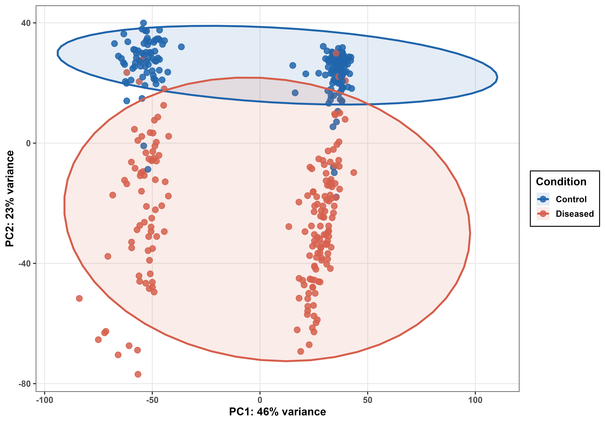
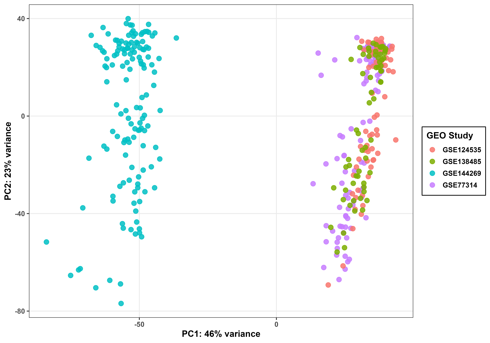
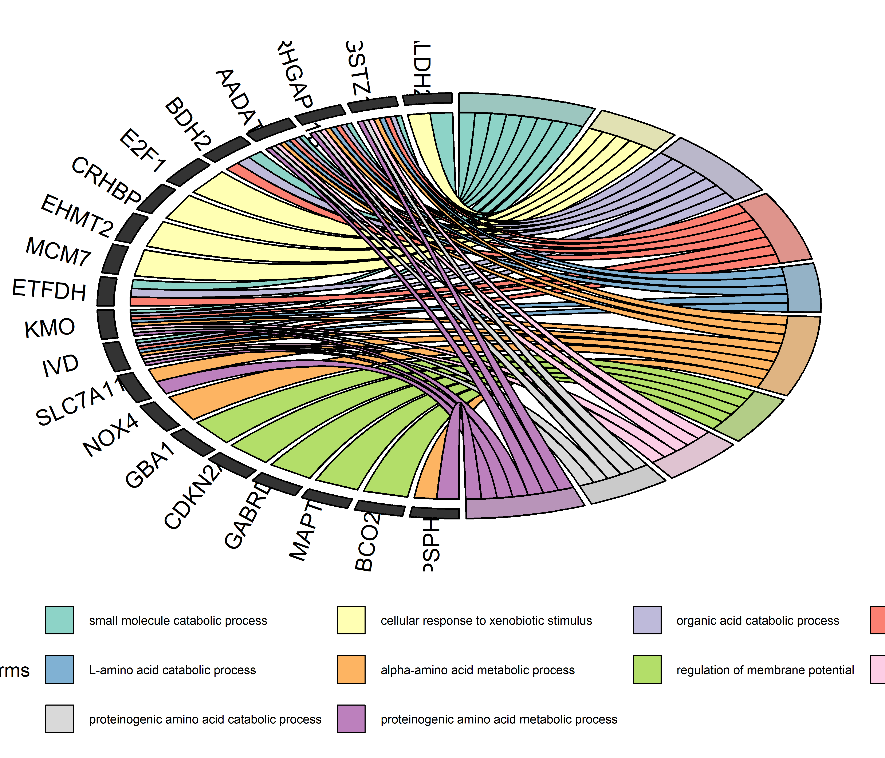
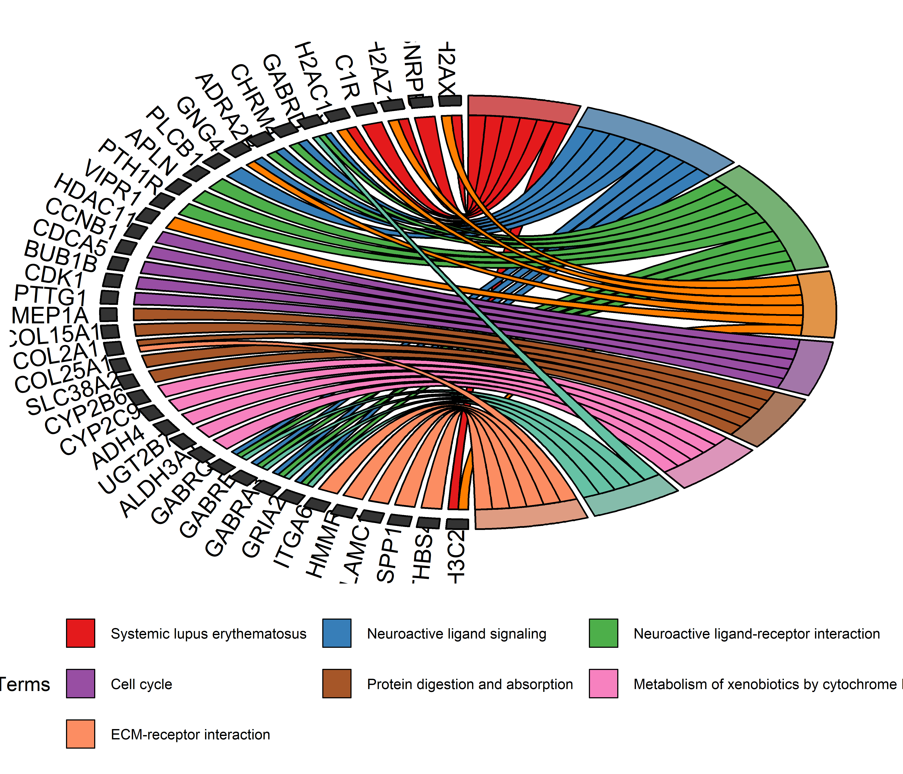
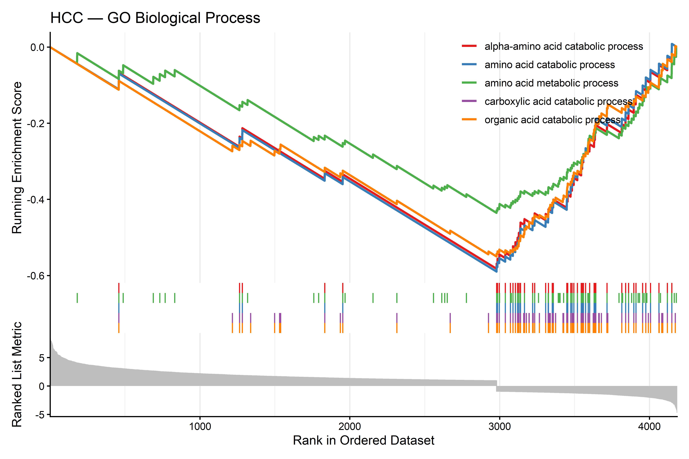
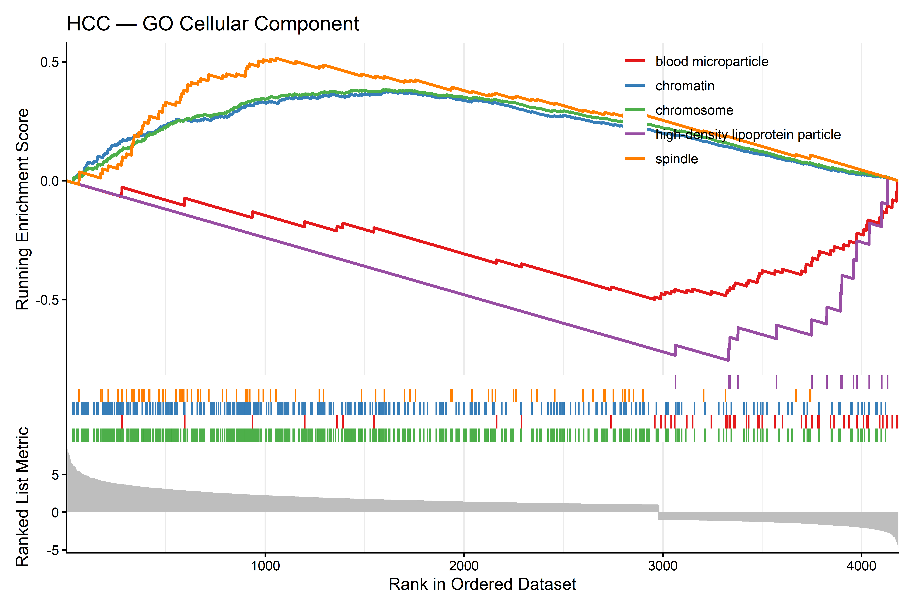
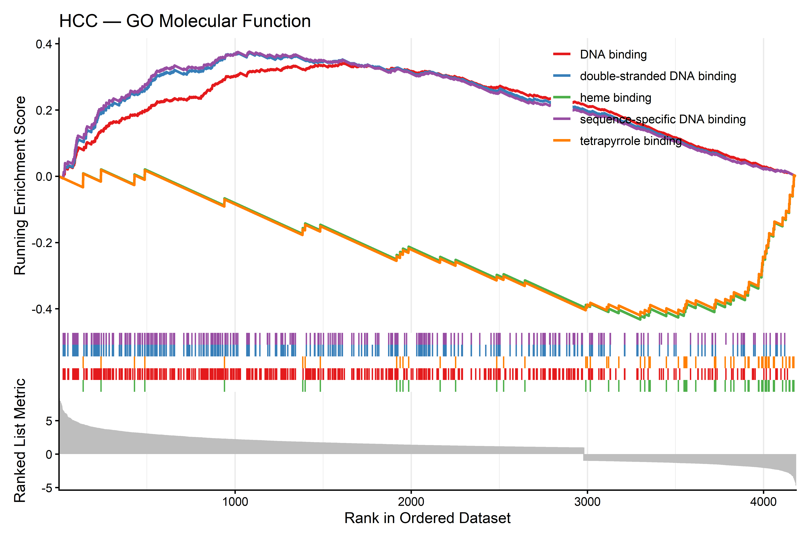
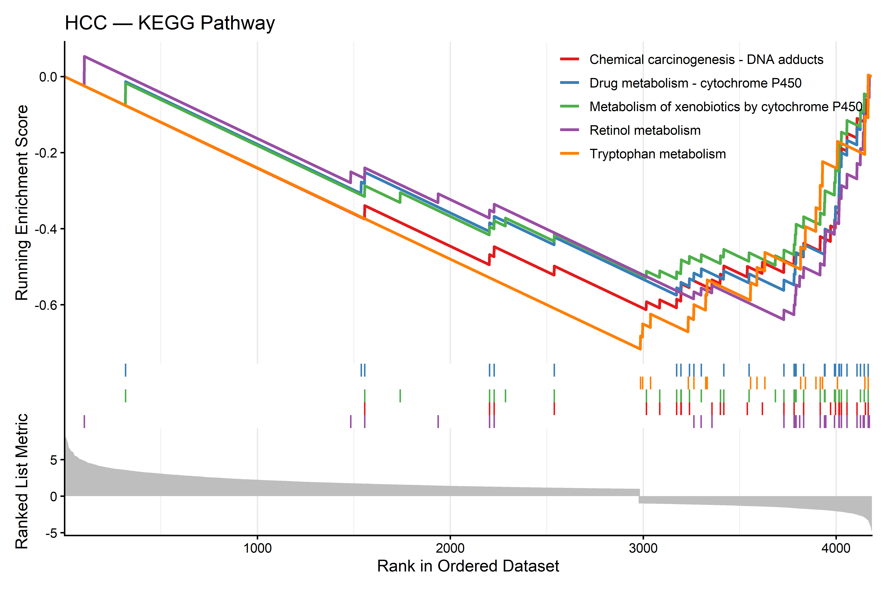

# Hepatocellular Carcinoma (HCC) — Bulk RNA-seq Differential Gene Expression Analysis

## Project Overview

This repository contains a comprehensive, multi-cohort bulk RNA-seq bioinformatics pipeline designed to identify differentially expressed genes (DEGs) and their associated biological pathways in Hepatocellular Carcinoma (HCC). By integrating four independent GEO datasets sequenced against the same GRCh38.p13 NCBI reference genome, the pipeline accounts for inter-study batch effects within the DESeq2 design model to uncover robust transcriptomic signatures driving HCC pathogenesis. The workflow spans raw count matrix integration, DESeq2-based differential expression, protein-coding gene filtering, functional enrichment (GO and KEGG), Gene Set Enrichment Analysis (GSEA), GOChord visualization, and Weighted Gene Co-expression Network Analysis (WGCNA).

## Pipeline Implementation

The entire computational workflow — from raw count matrix loading and batch-aware normalization to differential expression, enrichment analysis, and WGCNA — is implemented in a single, modular, and reproducible R script.

**Main Analysis Script:** [`r_script/liver_lihc_final.R`](r_script/liver_lihc_final.R)

The script is designed to be fully reproducible given the required R dependencies and raw GEO data accessions listed below. All output directories are created programmatically by the script.

## Datasets Analyzed

Raw gene-level count matrices were sourced from the NCBI Gene Expression Omnibus (GEO). All four datasets were independently aligned to the **GRCh38.p13 NCBI** reference genome and provided as Entrez gene ID-indexed count matrices. A merged dataset was constructed by taking the intersection of common genes across all four cohorts.

| GEO Accession | Samples (Control / HCC) | Platform |
|---|---|---|
| [GSE77314](https://www.ncbi.nlm.nih.gov/geo/query/acc.cgi?acc=GSE77314) | Normal liver vs HCC tumor | RNA-seq (GRCh38.p13 NCBI) |
| [GSE124535](https://www.ncbi.nlm.nih.gov/geo/query/acc.cgi?acc=GSE124535) | Normal liver vs HCC tumor | RNA-seq (GRCh38.p13 NCBI) |
| [GSE138485](https://www.ncbi.nlm.nih.gov/geo/query/acc.cgi?acc=GSE138485) | Normal liver vs HCC tumor | RNA-seq (GRCh38.p13 NCBI) |
| [GSE144269](https://www.ncbi.nlm.nih.gov/geo/query/acc.cgi?acc=GSE144269) | Normal liver vs HCC tumor | RNA-seq (GRCh38.p13 NCBI) |

- **Condition labels:** `Control` = normal liver tissue | `Diseased` = HCC tumor tissue
- **Batch variable:** GEO Study ID (GSE accession), used as a covariate in the DESeq2 design formula
- **Sample metadata:** [`count_matrix_metadata/HCC_metadata.csv`](count_matrix_metadata/HCC_metadata.csv)

## Analytical Pipeline and Methodology

### 1. Count Matrix Loading and Gene Intersection

Each raw count matrix was loaded using `data.table::fread()` with Entrez gene IDs as rownames. The intersection of common genes across all four matrices was computed using `Reduce(intersect, ...)` to retain only genes present in every dataset. After subsetting to the common gene universe, all matrices were column-bound into a single merged count matrix. Rows with zero total counts across all samples were removed. The merged matrix was saved as `HCC_merged_raw_counts.tsv`.

### 2. DESeq2 Object Construction and Pre-filtering

A `DESeqDataSet` object was created from the merged raw count matrix using the design formula `~ batch + condition`, where `batch` corresponds to the GEO study of origin and `condition` is the binary tumor/normal label. This design explicitly models and accounts for cross-study variability while estimating the effect of HCC condition. Low-count genes were removed by retaining only genes with a minimum of 10 read counts in at least 10 samples (`rowSums(counts(dds) >= 10) >= 10`).

### 3. Differential Expression Analysis (DESeq2)

DESeq2 was run using `DESeq()` with the negative binomial generalized linear model framework. Results were extracted for the contrast `Diseased vs Control` at `alpha = 0.05`. Entrez gene IDs were mapped to HGNC gene symbols using `mapIds()` from `org.Hs.eg.db`. Genes were classified into three regulation categories:

- **Up-regulated:** `padj < 0.05` AND `log2FoldChange > 1`
- **Down-regulated:** `padj < 0.05` AND `log2FoldChange < -1`
- **Not significant (NS):** All remaining genes

All results including NS genes were saved to `DESeq2_all_genes_with_symbols.csv`.

### 4. Protein-coding Gene Filter

Significant DEGs were further filtered to retain only protein-coding genes by excluding non-coding RNA patterns using regular expression matching on gene symbols. The following biotypes were excluded:

| Pattern | Biotype Excluded |
|---|---|
| `^LOC[0-9]` | Uncharacterized loci |
| `^MIR[0-9]` | microRNAs |
| `^LINC[0-9]` | Long intergenic non-coding RNAs |
| `^MT-` | Mitochondrial genes |
| `^SNORD`, `^SNORA` | Small nucleolar RNAs |
| `^RNU[0-9]`, `^RN7SL` | Small nuclear RNAs |
| `^SNHG[0-9]`, `^SCARNA[0-9]` | snoRNA host genes / scaRNAs |
| `MALAT`, `NEAT` | Long non-coding RNAs |
| `^H19$`, `^XIST$`, `^MEG[0-9]`, `^PEG[0-9]` | Imprinted / lncRNA genes |

Two output tables were saved:
- `DESeq2_significant_DEGs_all.csv` — all significant DEGs including non-coding
- `DESeq2_significant_DEGs_proteinCoding.csv` — protein-coding DEGs only

### 5. VST Normalization

Variance Stabilizing Transformation (VST) was applied to the filtered DESeq2 dataset using `vst()`. The resulting normalized expression matrix was used for PCA, heatmap visualization, and WGCNA. Entrez gene IDs were mapped to HGNC symbols and a gene-symbol-indexed VST expression table was saved as `VST_normalized_expression_symbols.csv`. R objects (`HCC_dds.rds`, `HCC_vst_data.rds`, `HCC_vst_mat.rds`, etc.) were serialized for downstream reuse.

### 6. Principal Component Analysis (PCA)

PCA was performed on the VST-normalized data using `DESeq2::plotPCA()` with two grouping variables: `condition` (Control vs Diseased) and `batch` (GEO study). Two plots were generated — one coloured by condition and one by GEO study batch — to visually confirm that the batch covariate in the DESeq2 design successfully decoupled biological signal from inter-study technical variance. Ellipses at the 95% confidence level were drawn for the condition plot using `stat_ellipse()`.

### 7. Heatmap of Top DEGs

The top 25 most significantly upregulated and top 25 most significantly downregulated protein-coding DEGs (ranked by adjusted p-value) were selected for hierarchical heatmap visualization using `ComplexHeatmap`. VST expression values were row-scaled to Z-scores (`t(scale(t(hmat)))`). Samples were arranged with all Controls first followed by all HCC tumors, split by condition. Column clustering within each condition group was performed. Annotations included condition (Control/Diseased), dataset (GEO batch), and regulation direction (Up/Down). A green-black-red color scale was applied from Z-score −2 to +2.

### 8. Functional Enrichment Analysis (ORA — GO and KEGG)

Over-representation analysis (ORA) was performed on the protein-coding significant DEG Entrez IDs using `clusterProfiler::enrichGO()` for all three Gene Ontology sub-ontologies and `clusterProfiler::enrichKEGG()` for KEGG pathways. All analyses applied Benjamini-Hochberg (BH) multiple testing correction with thresholds `pvalueCutoff = 0.05` and `qvalueCutoff = 0.05`. KEGG gene IDs were converted to readable gene symbols using `setReadable()`. Separate enrichment analyses were also performed for upregulated and downregulated gene sets independently, with results saved as `*_with_direction.csv` files. The top 10 terms per GO sub-ontology were visualized as a combined faceted bar plot, and the top 20 KEGG pathways were shown as a dot plot.

### 9. GOChord Visualization

GOChord chord diagrams were generated to visualize the gene-to-pathway relationships for GO Biological Process and KEGG enrichment results. These circular chord plots illustrate which genes contribute to multiple overlapping pathways simultaneously, providing an intuitive view of pathway-gene connectivity.

### 10. Gene Set Enrichment Analysis (GSEA)

GSEA was performed using `clusterProfiler::gseGO()` for GO Biological Process, Cellular Component, and Molecular Function sub-ontologies, and `clusterProfiler::gseKEGG()` for KEGG pathways. The input gene list was a pre-ranked vector of all expressed genes sorted by `log2FoldChange` (Diseased vs Control), enabling enrichment scoring across the full transcriptome without an arbitrary significance cutoff. BH correction was applied at `pvalueCutoff = 0.05`. Results were saved per sub-ontology as `GSEA_BP_results.csv`, `GSEA_CC_results.csv`, `GSEA_MF_results.csv`, and `GSEA_KEGG_results.csv`. GSEA enrichment plots were exported in PNG, SVG, and TIFF formats.

### 11. Weighted Gene Co-expression Network Analysis (WGCNA)

WGCNA was performed on the symbol-indexed VST expression matrix. The top 5,000 most variable genes (by variance) were retained after passing the `goodSamplesGenes()` quality check. A signed co-expression network was constructed using `blockwiseModules()` with the following parameters:

| Parameter | Value |
|---|---|
| Network type | Signed |
| Soft threshold power | 8 (selected from scale-free topology plot, R² ≥ 0.80) |
| Merge cut height | 0.25 |
| Max block size | 10,000 |
| Random seed | 1234 |

Module eigengenes (MEs) were correlated against binary clinical traits (Diseased / Control) using Pearson correlation and Student's t-distribution p-values (`corPvalueStudent()`). Gene significance (GS) vs Module Membership (MM) scatter plots were generated for the top 6 HCC-correlated modules, with marginal histograms produced using `ggExtra::ggMarginal()`.

## Project Visualizations

### 1. Quality Control — Principal Component Analysis

PCA of VST-normalized expression data coloured by biological condition and by GEO study of origin. These plots confirm that Control and HCC samples separate along PC1, while the batch covariate (modelled in the DESeq2 design) does not dominate the principal components.

  
  

 

### 2. Differential Gene Expression — MA Plot and Volcano Plot

The MA plot displays log2 fold change against mean expression across all genes. The Volcano plot shows statistical significance (−log10 adjusted p-value) against log2 fold change, with the top 10 upregulated and top 10 downregulated protein-coding genes labeled using `ggrepel`. Significance thresholds: `padj < 0.05`, `|log2FC| > 1`.

  
  

 

### 3. Heatmap of Top 50 DEGs

Hierarchical clustering heatmap of the top 25 upregulated and top 25 downregulated protein-coding DEGs. Expression values are row-scaled to Z-scores. Columns are split by condition (Control | Diseased) and annotated by GEO dataset batch. Row annotation indicates regulation direction.

  

 

### 4. Functional Enrichment — Gene Ontology and KEGG

Over-representation analysis results for the three GO sub-ontologies and KEGG pathways. The top 10 terms per GO category are shown as bar plots faceted by sub-ontology. KEGG results are shown as a dot plot with dot size proportional to gene count and color representing adjusted p-value.

  
  

  
  

 

### 5. GOChord Diagrams

GOChord circular chord diagrams illustrating gene-to-pathway connectivity for GO Biological Process and KEGG enrichment. Each chord links a gene to the pathways it contributes to, revealing multi-pathway hub genes.

  
  

 

### 6. Gene Set Enrichment Analysis (GSEA)

GSEA enrichment plots for GO sub-ontologies and KEGG pathways using a pre-ranked gene list (sorted by log2 fold change). Positive normalized enrichment scores indicate gene sets enriched in HCC tumors; negative scores indicate gene sets enriched in normal liver tissue.

  
  

  
  

 

## Repository Structure
