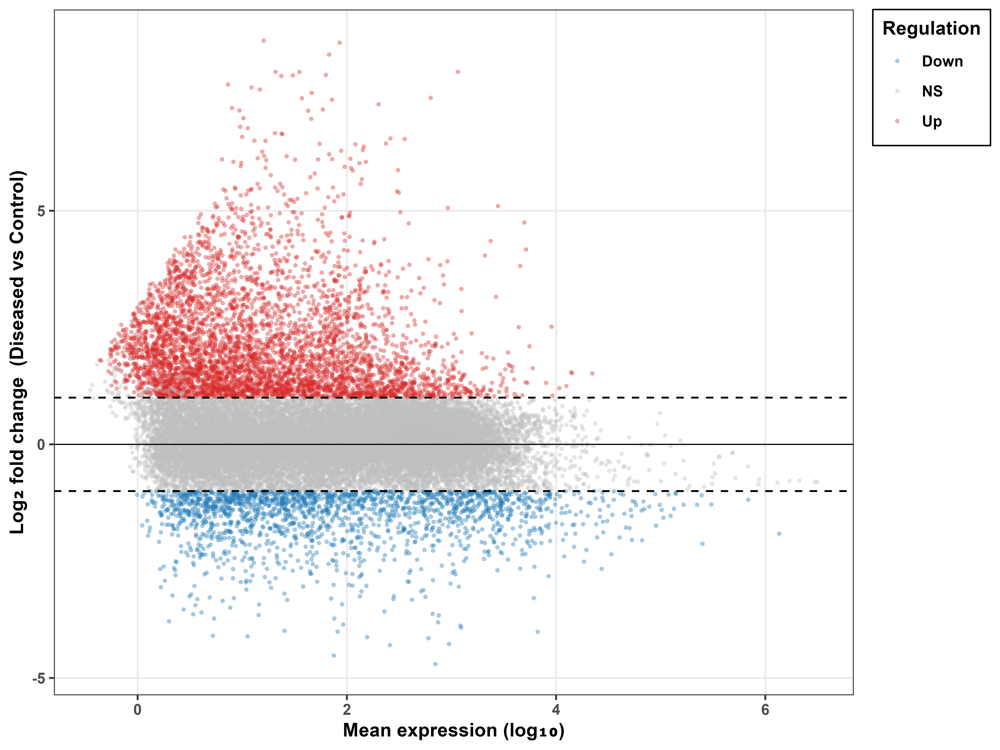
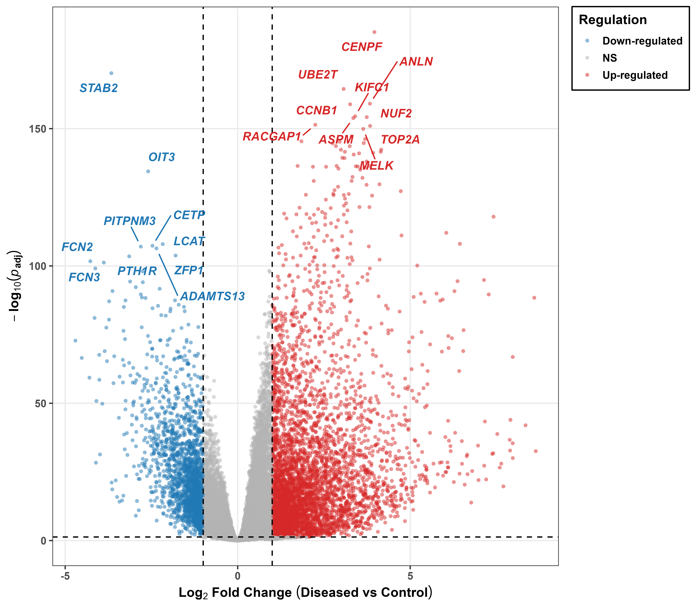
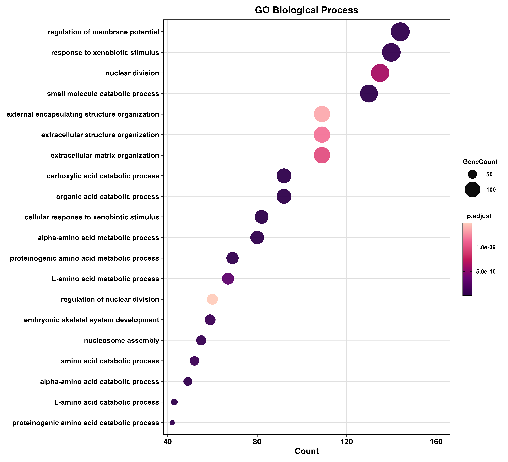
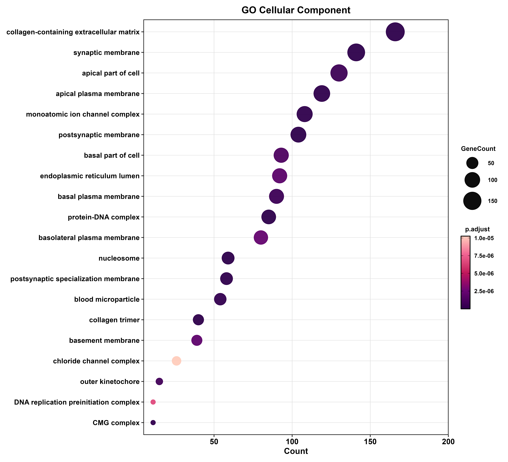
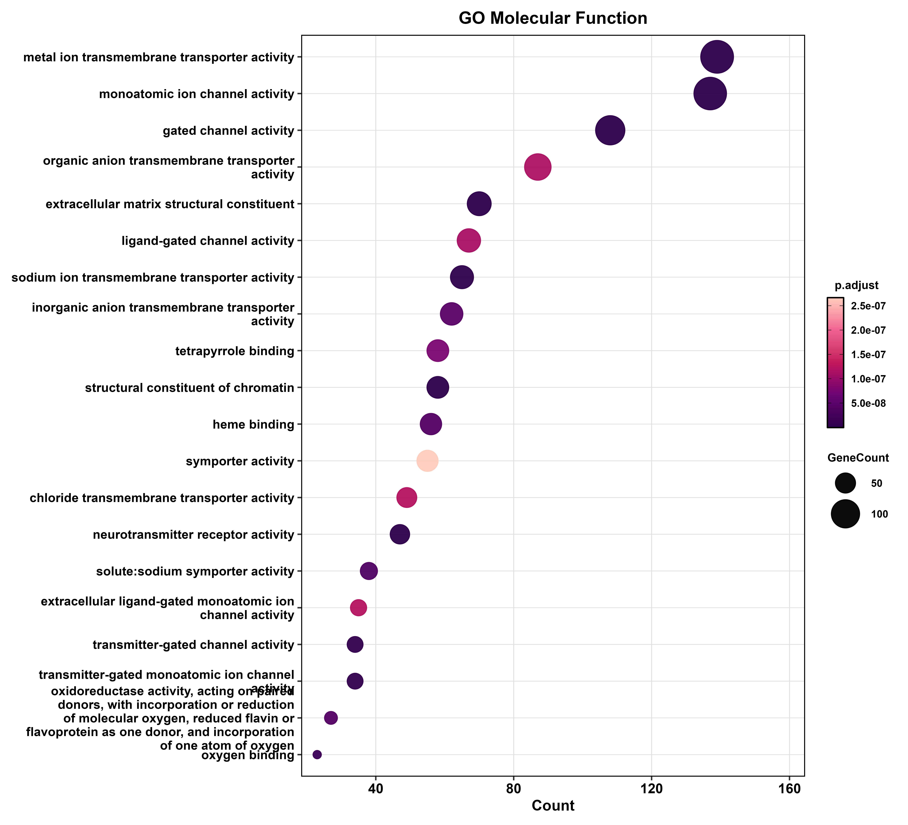
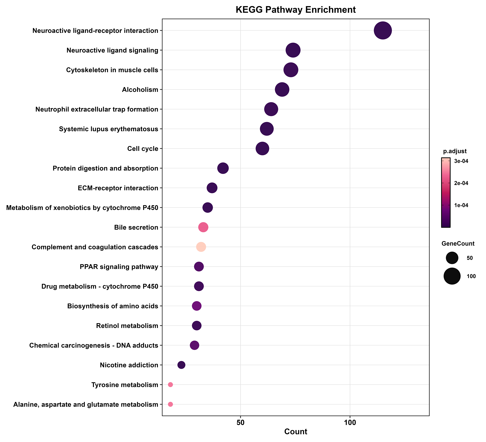

# Hepatocellular Carcinoma (HCC) — Bulk RNA-seq Differential Gene Expression Analysis

## Project Overview

This repository contains a comprehensive, multi-cohort bulk RNA-seq bioinformatics pipeline for Hepatocellular Carcinoma (HCC). By integrating four independent GEO datasets aligned to GRCh38.p13, the pipeline models inter-study batch effects within the DESeq2 design formula to identify robust transcriptomic signatures. The workflow covers raw count matrix integration, DESeq2-based differential expression, protein-coding gene filtering, functional enrichment (GO and KEGG), Gene Set Enrichment Analysis (GSEA), and Weighted Gene Co-expression Network Analysis (WGCNA).

**Main Analysis Script:** [`r_script/liver_lihc_final.R`](r_script/liver_lihc_final.R)

---

## Datasets Analyzed

All four datasets were aligned to the **GRCh38.p13 NCBI** reference genome and provided as Entrez gene ID-indexed raw count matrices. Merged by intersecting common genes across all cohorts.

| GEO Accession | Condition | Platform |
|---|---|---|
| [GSE77314](https://www.ncbi.nlm.nih.gov/geo/query/acc.cgi?acc=GSE77314) | Normal liver vs HCC | RNA-seq GRCh38.p13 |
| [GSE124535](https://www.ncbi.nlm.nih.gov/geo/query/acc.cgi?acc=GSE124535) | Normal liver vs HCC | RNA-seq GRCh38.p13 |
| [GSE138485](https://www.ncbi.nlm.nih.gov/geo/query/acc.cgi?acc=GSE138485) | Normal liver vs HCC | RNA-seq GRCh38.p13 |
| [GSE144269](https://www.ncbi.nlm.nih.gov/geo/query/acc.cgi?acc=GSE144269) | Normal liver vs HCC | RNA-seq GRCh38.p13 |

- **Condition labels:** `Control` = normal liver | `Diseased` = HCC tumor
- **Batch variable:** GEO Study ID — modelled as covariate in DESeq2 design `~ batch + condition`
- **Sample metadata:** [`count_matrix_metadata/HCC_metadata.csv`](count_matrix_metadata/HCC_metadata.csv)

---

## Analytical Pipeline

### 1. Count Matrix Integration
Raw count matrices loaded with `data.table::fread()`. Common genes across all four datasets identified using `Reduce(intersect, ...)`, matrices subset and column-bound into a single merged matrix. Rows with zero total counts removed. Saved as `HCC_merged_raw_counts.tsv`.

### 2. DESeq2 Differential Expression
`DESeqDataSet` constructed with design formula `~ batch + condition`. Low-count genes removed (>=10 counts in >=10 samples). DESeq2 run with negative binomial GLM. Results extracted for `Diseased vs Control` at `alpha = 0.05`. Entrez IDs mapped to HGNC symbols via `org.Hs.eg.db`.

- **Up-regulated:** `padj < 0.05` AND `log2FC > 1`
- **Down-regulated:** `padj < 0.05` AND `log2FC < -1`

### 3. Protein-coding Gene Filter
Significant DEGs filtered to retain only protein-coding genes by excluding: uncharacterized loci (`LOC*`), miRNAs (`MIR*`), lincRNAs (`LINC*`), mitochondrial genes (`MT-`), snoRNAs (`SNORD*`, `SNORA*`), snRNAs (`RNU*`, `RN7SL`), snoRNA host genes (`SNHG*`, `SCARNA*`), and known lncRNAs (`MALAT1`, `NEAT1`, `H19`, `XIST`, `MEG*`, `PEG*`).

### 4. VST Normalization
Variance Stabilizing Transformation (`vst()`) applied to the full filtered DESeq2 dataset. VST matrix used for PCA, heatmap, and WGCNA. Entrez IDs mapped to gene symbols and saved as `VST_normalized_expression_symbols.csv`.

### 5. Heatmap of Top DEGs
Top 25 upregulated and top 25 downregulated protein-coding DEGs (by adjusted p-value) visualized using `ComplexHeatmap`. VST values row-scaled to Z-scores. Samples ordered Control then Diseased. Annotations: condition, GEO batch, regulation direction. Color scale: green to black to red (Z-score -2 to +2).

### 6. Functional Enrichment (ORA)
Over-representation analysis using `clusterProfiler::enrichGO()` (BP, CC, MF) and `enrichKEGG()`. BH correction, `pvalueCutoff = 0.05`, `qvalueCutoff = 0.05`. Separate analyses for Up and Down gene sets saved as `*_with_direction.csv`. Top 10 GO terms per sub-ontology shown as faceted bar plot; top 20 KEGG pathways as dot plot.

### 7. Gene Set Enrichment Analysis (GSEA)
`gseGO()` and `gseKEGG()` run on a pre-ranked gene list sorted by `log2FoldChange`. BH correction at `pvalueCutoff = 0.05`. Positive NES = enriched in HCC tumors; negative NES = enriched in normal liver.

### 8. WGCNA
Performed on the top 5,000 most variable genes from the symbol-indexed VST matrix after `goodSamplesGenes()` QC. Signed co-expression network built with `blockwiseModules()`.

| Parameter | Value |
|---|---|
| Network type | Signed |
| Soft threshold power | 8 (R² >= 0.80) |
| Merge cut height | 0.25 |
| Max block size | 10,000 |
| Random seed | 1234 |

Module eigengenes correlated against binary traits (Diseased / Control). Gene Significance (GS) vs Module Membership (MM) scatter plots generated for the top 6 HCC-correlated modules with marginal histograms via `ggExtra::ggMarginal()`.

---

## Visualizations

### 1. Differential Gene Expression — MA Plot and Volcano Plot

The MA plot shows log2 fold change against mean expression across all genes. The Volcano plot labels the top 10 upregulated and top 10 downregulated protein-coding genes using `ggrepel`. Significance thresholds: `padj < 0.05`, `|log2FC| > 1`.

  
  

---

### 2. Heatmap of Top 50 DEGs

Hierarchical clustering heatmap of the top 25 upregulated and top 25 downregulated protein-coding DEGs. Rows are Z-score scaled. Columns split by condition (Control | Diseased) and annotated by GEO dataset batch. Row annotation indicates regulation direction (Up = green, Down = lavender).

  

---

### 3. Functional Enrichment — Gene Ontology and KEGG

Over-representation analysis for GO sub-ontologies (top 10 terms each, faceted bar plot colored by adjusted p-value) and KEGG pathways (top 20 terms, dot plot sized by gene count, colored by adjusted p-value).

  
  

  
  

---

### 4. WGCNA — Weighted Gene Co-expression Network Analysis

#### Network Construction — Soft Threshold, Dendrogram and Module Correlation

**(A)** Scale-free topology model fit (R²) vs soft threshold power. Red dashed line at R² = 0.80 marks the selection threshold — power = 8 was chosen.
**(B)** Mean network connectivity vs soft threshold power. Used alongside (A) to confirm power = 8 maintains adequate connectivity.
**(C)** Hierarchical clustering dendrogram of the top 5,000 most variable genes. Colored bars below show assigned module colors after merging closely correlated modules (merge cut height = 0.25).
**(D)** Inter-module topological overlap distance heatmap. Color scale: red = distance 0 (highly co-expressed) to white to blue = distance 1.5 (anti-correlated). Modules are hierarchically clustered.

  

 

#### Module-Trait Correlation and Gene Significance vs Module Membership

**(A)** Module eigengene-trait correlation heatmap. Each cell shows Pearson r and formatted p-value. The **blue** module shows the strongest negative correlation with Diseased (r = -0.87, p = 1e-114), indicating enrichment in normal liver. The **pink** module shows the strongest positive correlation with Diseased (r = 0.48, p = 4e-23), enriched in HCC tumors.
**(B-G)** Gene Significance (GS) vs Module Membership (MM) for the 6 modules most strongly correlated with HCC — blue, brown, green, magenta, pink, and yellow. High GS-MM correlation confirms intramodular hub genes are the most biologically relevant for HCC. Marginal histograms show GS and MM distributions. Pearson r and p-value annotated on each panel.

  

---

## Repository Structure
Hepatocellular-carcinoma-HCC-bulk-rna-seq-DGE/
├── r_script/
│ └── liver_lihc_final.R
├── count_matrix_metadata/
│ └── HCC_metadata.csv
├── results_HCC/
│ ├── 02_tables/
│ │ ├── DEG/
│ │ │ ├── DESeq2_all_genes_with_symbols.csv
│ │ │ ├── DESeq2_significant_DEGs_all.csv
│ │ │ └── DESeq2_significant_DEGs_proteinCoding.csv
│ │ ├── enrichment/
│ │ │ ├── GO_BP.csv / GO_BP_with_direction.csv
│ │ │ ├── GO_CC.csv / GO_CC_with_direction.csv
│ │ │ ├── GO_MF.csv / GO_MF_with_direction.csv
│ │ │ └── KEGG.csv / KEGG_with_direction.csv
│ │ ├── GSEA/
│ │ │ ├── GSEA_BP.csv / GSEA_BP_results.csv
│ │ │ ├── GSEA_CC.csv / GSEA_CC_results.csv
│ │ │ ├── GSEA_MF.csv / GSEA_MF_results.csv
│ │ │ └── GSEA_KEGG.csv / GSEA_KEGG_results.csv
│ │ └── WGCNA/
│ │ ├── Module_Gene_Assignments.csv
│ │ ├── Module_Trait_Correlations.csv
│ │ └── Module_Trait_Pvalues.csv
│ └── 03_plots/
│ ├── DEG/ # MA plot, Volcano plot (PNG)
│ ├── Heatmap/ # Top 25 up + top 25 down heatmap (PNG)
│ ├── enrichment/ # GO BP/CC/MF and KEGG plots (PNG)
│ ├── GOChord/ # GOChord diagrams (PNG)
│ ├── GSEA/ # GSEA enrichment plots (PNG, SVG)
│ └── WGCNA/ # WGCNA composite figures (PNG)
└── .gitignore

text

**Excluded from this repository:**
- Raw count TSV matrices (`count_matrix_metadata/*.tsv`) — up to 41 MB each
- R binary objects (`*.rds`) — DESeq2 object 353 MB, VST matrices 30-36 MB
- TIFF plot files (`*.tiff`) — 30-160 MB per file
- Oversized VST expression tables (`VST_normalized_expression*.csv`) — 118-122 MB each

---

## R Dependencies

### CRAN

| Package | Role |
|---|---|
| `data.table` | Fast TSV loading |
| `tidyverse` | Data wrangling and ggplot2 visualization |
| `ggrepel` | Non-overlapping gene labels on Volcano plot |
| `RColorBrewer` | Color palettes for batch annotations |
| `ggExtra` | Marginal histograms on WGCNA GS vs MM scatter plots |
| `WGCNA` | Weighted gene co-expression network analysis |

### Bioconductor

| Package | Role |
|---|---|
| `DESeq2` | Differential expression analysis |
| `org.Hs.eg.db` | Entrez ID to HGNC symbol annotation |
| `clusterProfiler` | GO ORA, KEGG ORA, GSEA |
| `enrichplot` | GSEA enrichment plot visualization |
| `ComplexHeatmap` | DEG heatmap and WGCNA module-trait heatmap |
| `circlize` | Color ramp functions for heatmap scales |
| `BiocParallel` | Parallel backend registration |

